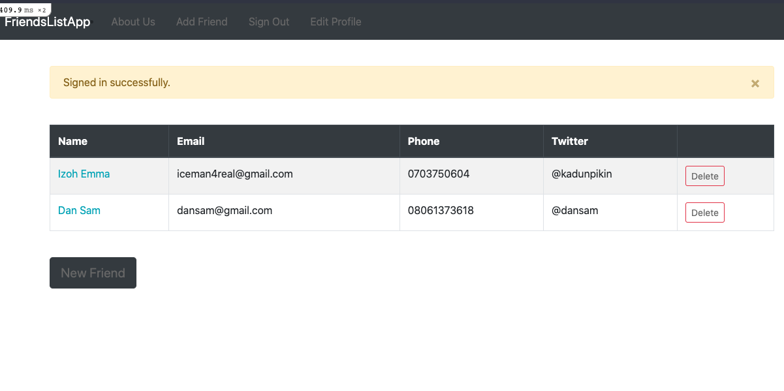

# Friends List App

- In this project, I build a friends list application, with knowledge gain from RoR modules to enable me cements and master the concept of working with ruby on rails, using PG to handle basic CRUD operations

- Listed below are Key concepts I mastered implementing this friends list application:
    - [x] Rails installations and set-up enabling environment to build a rails application
    - [x] Build a webpage with with ruby on rails
    - [x] Build my friend list app entire website with rails
    - [x] Implement CRUD functions or operations to handle database stuffs
    - [x] Use bootstrap gem with ruby on rails applications
    - [x] Use devise gem to handle application authentication and user management
    - [x] Master rails associations
    - [x] Fun with controller by adding more controller actions
    - [x] Master git and version control
    - [x] Deploy application to heroku 

## App Screenshot

## Built With

- Ruby and Ruby on Rails
- HTML & CSS
- Bootstrap
- Git and Github flow
- VSCode
- Linter Checkers
- Ruby Gem
- Heroku

<!-- ## Deployment Live Demo

 - Deployed with gh-pages
  - [Live Demo](https://dansam5k.github.io/Webflix-Index/index.html) -->
## Getting Started

To get a local copy up and running follow these simple example steps.

### Prerequisites

- IDE to edit and run the code (We use Visual Studio Code 🔥).
- [Node.js](https://nodejs.org/en/download/) already downloaded.
- Install [Rails](https://guides.rubyonrails.org/getting_started.html)
### Install

To get a local copy up and running follow these simple example steps.
- Open terminal
- Clone this project using the command `git clone https://github.com/DanSam5K/React-Redux-SpaceX-Group-Project.git`
- `cd <clone>` folder
- Run `bundle install` to install all gem project dependencies
- Run `rails s` in your terminal and listen on local server http://[::1]:3000.

## Author 👤 

👨‍💻 **Daniel Samuel**

- Github: [DanSam5k](https://github.com/DanSam5k)
- Twitter: [@_dan_sam](https://twitter.com/_dan_sam)
- Linkedin: [dansamuel](https://www.linkedin.com/in/dansamuel/)

## 🤝 Contributing

Contributions, issues, and feature requests are welcome!

Feel free to check the [issues page](hhttps://github.com/DanSam5K/React-Redux-SpaceX-Group-Project/issues).

## Show your support

Give a ⭐️ if you like this project!

## Acknowledgments

- Hat tip to anyone whose code was used 🔰
- Inspiration 💘
- Microverse program ⚡
- Our standup team 🏹
- Our family's support 🙌

## 📝 License

This project is [MIT](./LICENSE) licensed.
